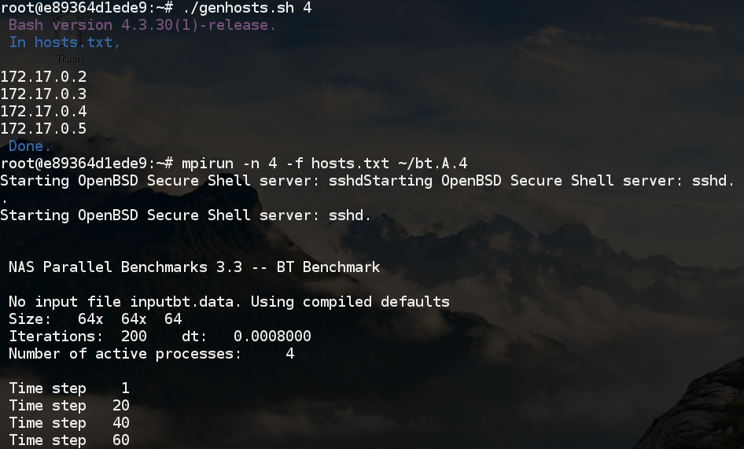

# Introduction
CLUSIM: A Fast and Scalable Trace-Driven Computer Cluster Simulator  
Authors: Cheng-Yueh Liu, Po-Yao Huang, Yuan-Di Li 

# Prerequisite

## Ubuntu 16.04
`sudo apt-get install docker.io` 

## CentOS 7
`sudo yum install docker`


# How To Execute a Simple MPI Application on Virtual Container Cluster
## 1. Setup Docker
```
sudo systemctl enable docker
sudo systemctl start docker
```

## 2. Empower Linux Users with tcpdump Tracing on Docker Network Interface

```
cd clusim
./tools/empower-tcpdump.sh username
tcpdump -i docker0 -w justForTest.pcap
```

## 3. Lauch a Docker-based Virtual Cluster and Run a MPI-application
```
cd clusim/vcluster
docker build -t vcluster .
./start-vcluster.sh 4 0
```
Then, we will log in to master node (node0) 
```
cd ~ && ./demo-npb.sh
```
### Snapshot of Demo 



## 4. Build NS-3
```
cd clusim/ns3
./build.py 
```

## 5. Using Clusim to Simulate and Analyze Network Performance
Modify the path to the logged pcap file in simple.cfg  
```
cd clusim  
make 
cp config/default.cfg .
./clusim default.cfg 
```
